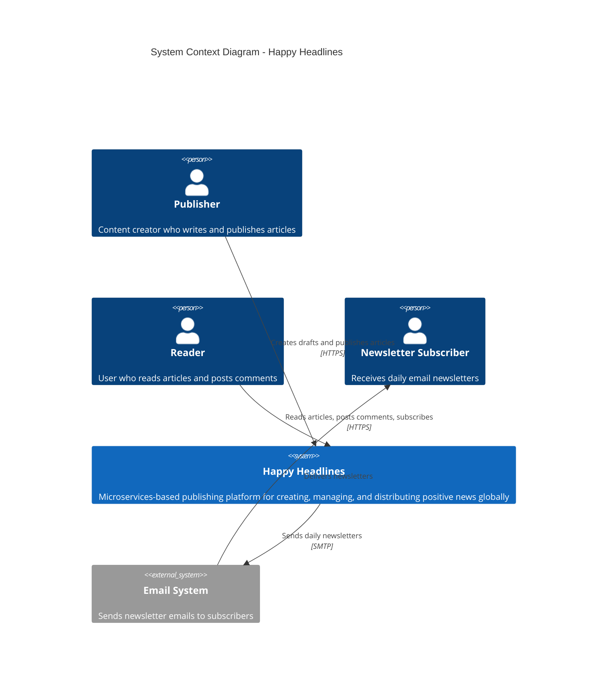
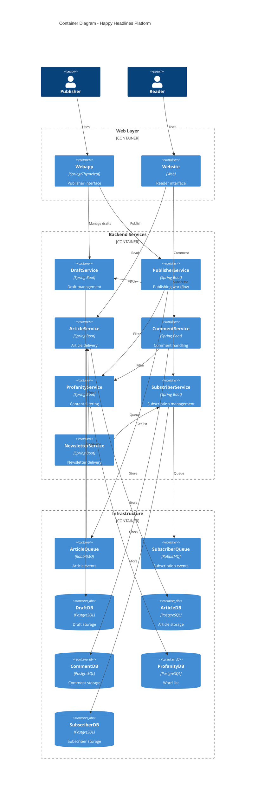

## Level 1

```mermaid
C4Context
    title System Context Diagram - Happy Headlines

    Person(publisher, "Publisher", "Content creator who writes and publishes articles")
    Person(reader, "Reader", "User who reads articles and posts comments")
    Person(subscriber, "Newsletter Subscriber", "Receives daily email newsletters")

    System(happy_headlines, "Happy Headlines", "Microservices-based publishing platform for creating, managing, and distributing positive news globally")

    System_Ext(email, "Email System", "Sends newsletter emails to subscribers")

    Rel(publisher, happy_headlines, "Creates drafts and publishes articles", "HTTPS")
    Rel(reader, happy_headlines, "Reads articles, posts comments, subscribes", "HTTPS")
    Rel(happy_headlines, email, "Sends daily newsletters", "SMTP")
    Rel(email, subscriber, "Delivers newsletters")

    UpdateLayoutConfig($c4ShapeInRow="3", $c4BoundaryInRow="1")
```

## Level 2

```mermaid
C4Container
    title Container Diagram - Happy Headlines Platform

    Person(publisher, "Publisher")
    Person(reader, "Reader")

    Container_Boundary(web, "Web Layer") {
        Container(webapp, "Webapp", "Spring/Thymeleaf", "Publisher interface")
        Container(website, "Website", "Web", "Reader interface")
    }

    Container_Boundary(services, "Backend Services") {
        Container(draft_svc, "DraftService", "Spring Boot", "Draft management")
        Container(publisher_svc, "PublisherService", "Spring Boot", "Publishing workflow")
        Container(article_svc, "ArticleService", "Spring Boot", "Article delivery")
        Container(comment_svc, "CommentService", "Spring Boot", "Comment handling")
        Container(profanity_svc, "ProfanityService", "Spring Boot", "Content filtering")
        Container(subscriber_svc, "SubscriberService", "Spring Boot", "Subscription management")
        Container(newsletter_svc, "NewsletterService", "Spring Boot", "Newsletter delivery")
    }

    Container_Boundary(infra, "Infrastructure") {
        Container(article_queue, "ArticleQueue", "RabbitMQ", "Article events")
        Container(subscriber_queue, "SubscriberQueue", "RabbitMQ", "Subscription events")
        ContainerDb(draft_db, "DraftDB", "PostgreSQL", "Draft storage")
        ContainerDb(article_db, "ArticleDB", "PostgreSQL", "Article storage")
        ContainerDb(comment_db, "CommentDB", "PostgreSQL", "Comment storage")
        ContainerDb(profanity_db, "ProfanityDB", "PostgreSQL", "Word list")
        ContainerDb(subscriber_db, "SubscriberDB", "PostgreSQL", "Subscriber storage")
    }

    %% Publisher workflow
    Rel(publisher, webapp, "Uses")
    Rel(webapp, draft_svc, "Manage drafts")
    Rel(webapp, publisher_svc, "Publish")
    Rel(draft_svc, draft_db, "Store")
    Rel(publisher_svc, draft_svc, "Fetch")
    Rel(publisher_svc, profanity_svc, "Filter")
    Rel(publisher_svc, article_queue, "Queue")
    Rel(article_queue, article_svc, "Consume")
    Rel(article_svc, article_db, "Store")

    %% Reader workflow
    Rel(reader, website, "Uses")
    Rel(website, article_svc, "Read")
    Rel(website, comment_svc, "Comment")
    Rel(website, subscriber_svc, "Subscribe")
    Rel(comment_svc, profanity_svc, "Filter")
    Rel(comment_svc, comment_db, "Store")
    Rel(profanity_svc, profanity_db, "Check")

    %% Subscription workflow
    Rel(subscriber_svc, subscriber_db, "Store")
    Rel(subscriber_svc, subscriber_queue, "Queue")
    Rel(newsletter_svc, article_svc, "Fetch")
    Rel(newsletter_svc, subscriber_svc, "Get list")

    UpdateLayoutConfig($c4ShapeInRow="4", $c4BoundaryInRow="1")
```
